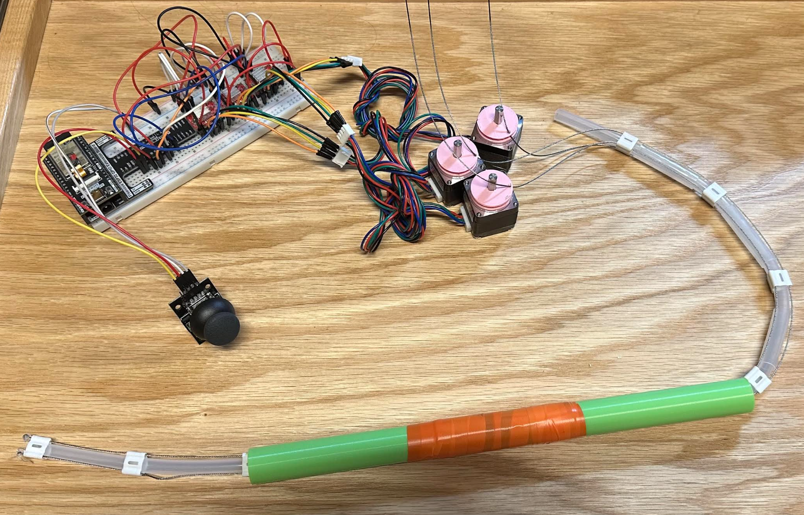

# Bionic Laboratory: Multi-DOF Control System

## Overview
As an Undergraduate Researcher at the Bionic Laboratory, I am developing a multi-degree-of-freedom (DOF) control system. This project relies heavily on iterative modeling in SolidWorks to optimize cable-driven kinematics and mechanical advantage.
Below is a visualization of the  system. My work focuses on designing critical mechanical interfaces between the control handle and distal tip to ensure synchronized motion and structural integrity. Furthermore, I perform stress analysis to select high-performance, biocompatible materials based on fatigue life and operational load requirements.

## Key Engineering Achievements

* **Kinematic Optimization:** Developing a multi-DOF control system in Solidworks, utilizing iterative modeling to optimize cable-driven kinematics and mechanical advantage.
* **Interface Design:** Designing critical mechanical interfaces between the control handle and distal tip to ensure synchronized motion and structural integrity.
* **Finite Element Analysis (FEA):** Performing stress analysis to select high-performance, biocompatible materials based on fatigue life and operational load requirements.

