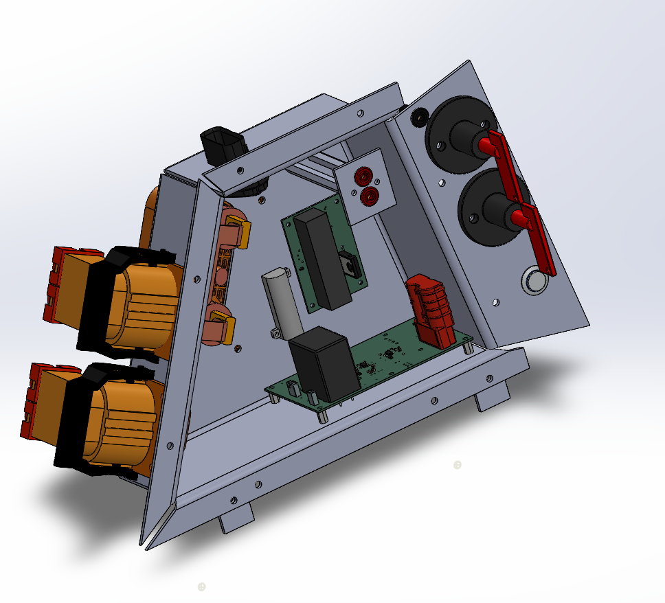
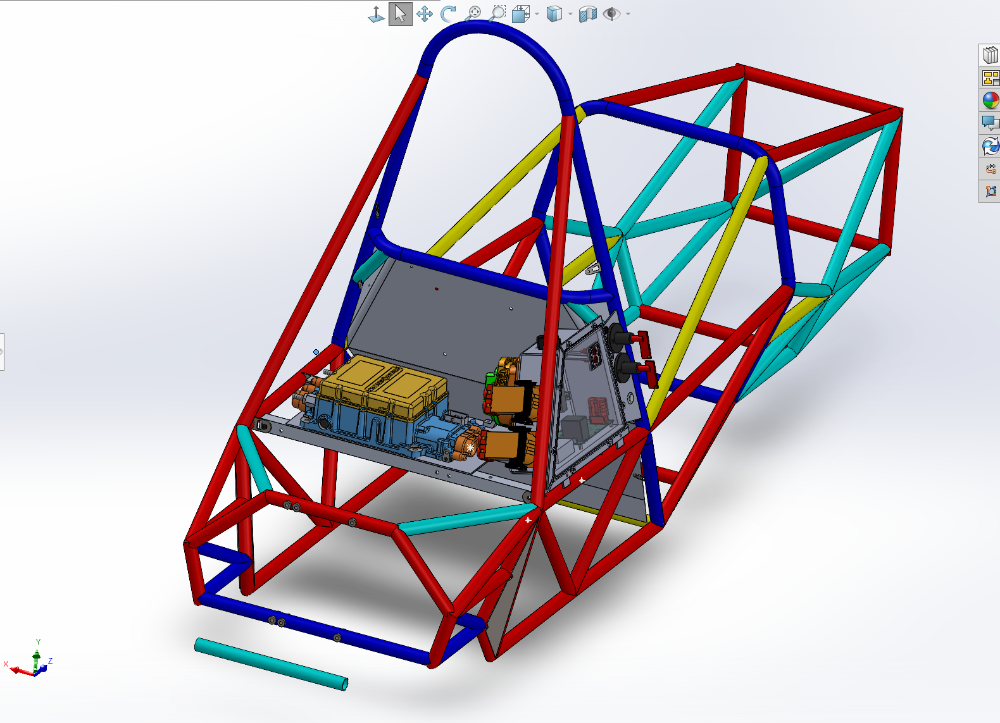

# Bruin Formula Racing: Tractive System Integration

## Overview
As the Tractive Integration Responsible Engineer for Bruin Formula Racing, I integrated high voltage electronics with mechanical cooling and powertrain subsystems in the vehicle using Solidworks. 

## High Voltage Service Panel Design
The CAD renders below showcase the high-voltage (HV) service panel mounted within the tubular chassis of our Formula car. 

*(Note: Rename your image files in your repository to match these links, or update the links below to match your exact file names like `Screenshot 2026-03-06 180143.jpg`!)*

**Key Engineering Achievements:**
* **Optimized Integration:** Redesigned service panel to improve efficiency by 75% over last years servicing time of 20 minutes.
* **Reliability:** Improved waterproofing for high voltage service panel by introducing more robust solutions.
* **Thermal Management:** Designed and optimized swirl pot to remove air from coolant by leveraging SolidWorks and ANSYS.
* **Rapid Manufacturing:** Increased speed of prototyping by 7x via novel PLA and PETG Swirl Pot design.
